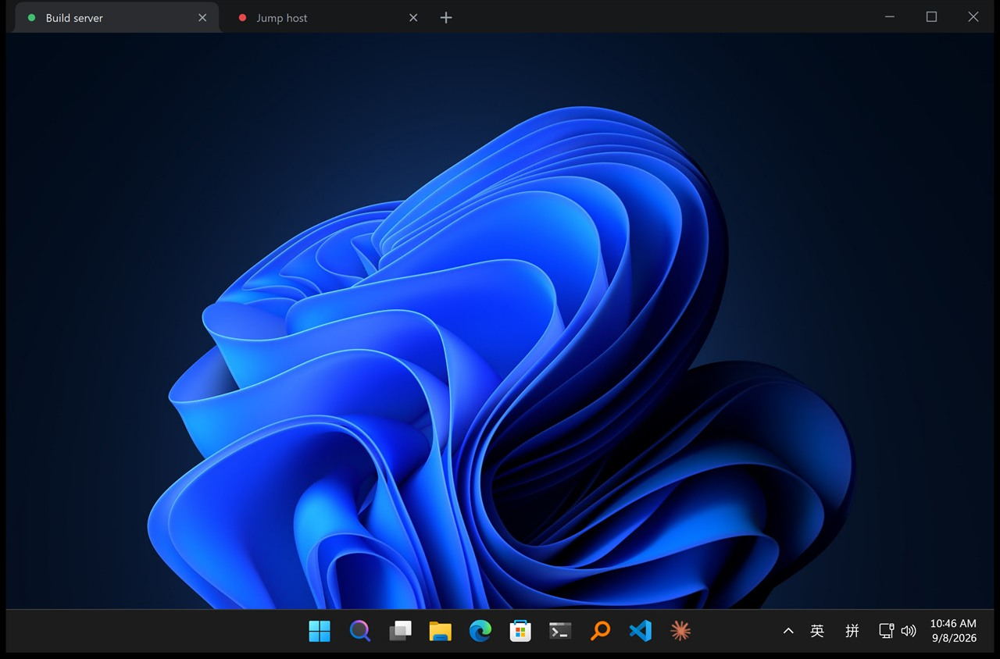
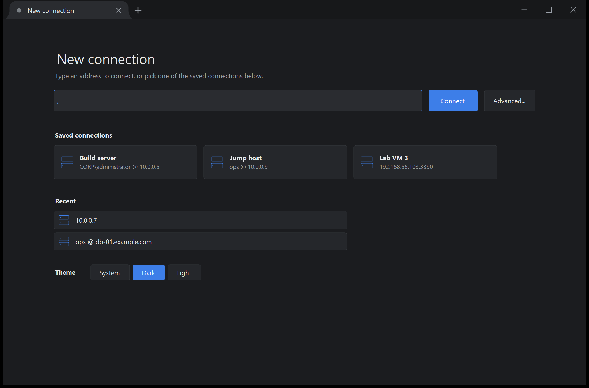
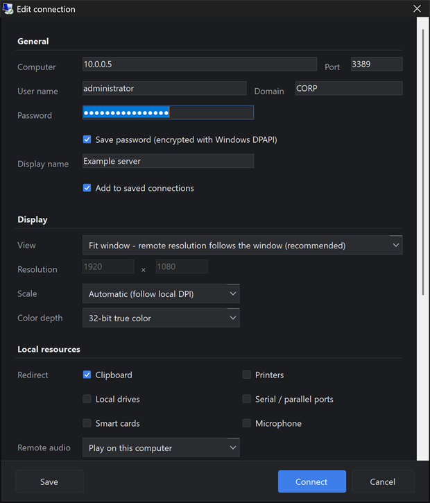

# RdpTabs — a Remote Desktop client with Chrome-style tabs

Windows' own mstsc works well; the one thing it lacks is **tabs**. RdpTabs reuses the Remote Desktop engine
that ships with Windows (the ActiveX control inside `mstscax.dll`, the same one mstsc drives) and only
replaces the shell: a Chrome-style tab strip on top, `+` for a new connection, one window for every session.



Every tab carries a status dot — grey = idle, amber spinner = connecting, green = connected, red = failed or
disconnected:


`+` opens a new connection page with quick connect, your saved connections and the recent ones. The theme
(system / dark / light) is switched at the bottom of that page and applied without a restart:



## Download

`RdpTabs.exe` from the [latest release](https://github.com/yzhou79/RdpTabs/releases/latest): one 456 KB file,
nothing to install and no runtime to fetch (.NET Framework 4.8 is part of Windows 10/11).

It is not code-signed, so SmartScreen shows "Windows protected your PC" the first time → *More info* →
*Run anyway*. Each release lists the SHA-256, which you can check with
`certutil -hashfile RdpTabs.exe SHA256`.

## Build

```bash
build.cmd
```

No .NET SDK needed: the script uses the Roslyn compiler that ships with Visual Studio and writes
`bin\RdpTabs.exe`. `build.cmd run` builds and runs it, `build.cmd test` runs the self test — 22 checks that
need no RDP server. On a machine with the SDK, `dotnet build -c Release` works off `RdpTabs.csproj` (same
sources, untested here).

## Using it

| Action | Result |
|---|---|
| Click `+` | New tab showing the "New connection" page |
| Quick-connect box | `10.0.0.5`, `10.0.0.5:3390`, `user@10.0.0.5`, `CORP\user@host:3390`, `[::1]:3389` |
| Click a tab / middle-click / drag | Switch / close / reorder |
| Right-click a tab | Disconnect, reconnect, edit, save as connection, close others |
| Drag the empty strip area | Move the window (snap, shake and double-click-to-maximize are the native ones) |
| Saved connection card | Click to connect, right-click to edit or delete |

```bash
RdpTabs.exe 10.0.0.5:3390                 # connect on startup -- good for a desktop shortcut
RdpTabs.exe 10.0.0.5 10.0.0.6 db@10.0.0.7 # three tabs at once
```

An address that matches a saved connection reuses that connection's settings and stored password.

`Ctrl+T` / `Ctrl+W` / `Ctrl+Tab` / `Ctrl+1`…`Ctrl+9` only work while focus is **outside** a remote session
(for example on the new connection page) — once you click into the remote picture, the keyboard belongs
entirely to that session.

"Advanced..." (or right-click a tab → Edit connection) opens the full editor: view mode and scale, colour
depth, redirection, experience tier, Windows keys, server authentication and RD Gateway.



Settings live in `%APPDATA%\RdpTabs\profiles.json`. With "Save password" ticked the password is encrypted with
**DPAPI** (the current Windows account's key), so the file holds Base64 ciphertext and never the plaintext;
another user or another machine simply gets an empty password.

## Worth knowing

- **Cancelling the Windows credential prompt hangs the control forever** and it never reports an error
  (verified). RdpTabs adds its own 30-second timeout, paused while the prompt is up. Fill in the password
  under "Edit connection" to skip the prompt entirely.
- **`Connected` means `0` disconnected, `1` connected, `2` connecting**, polled every 250 ms. Late binding
  cannot reach `IMsTscAxEvents`, so there are no events — and swapping 1 and 2 leaves the UI saying
  "connecting" over a live session.
- **SmartSizing only scales down, never up**, so "fit window" really changes the remote resolution via
  `UpdateSessionDisplaySettings` (450 ms debounce). Minimizing is ignored; maximizing is not.
- **The DPI scale can only be applied after connecting**: those properties live on `IMsRdpExtendedSettings`, a
  pure vtable interface late binding cannot touch — calling it in the order guessed from the IDL crashes the
  process. So the scale is pushed the moment the session comes up.
- Zero dependencies by design: COM through IDispatch late binding, DPAPI through crypt32 P/Invoke,
  hand-written JSON. That is what lets both build paths share one source tree with no NuGet packages.

## Known limits

- **No "send Ctrl+Alt+Del"**: it lives on `IMsRdpClientNonScriptable`, another pure vtable interface.
- **No full screen, no tearing tabs out into their own window, no .rdp import.**
- Local shortcuts are dead while the remote session has focus; fixing that needs a `WH_KEYBOARD_LL` hook.
- Only the extended disconnect reason is available, not the primary one — again, no events.
- Background tabs stay connected and keep repainting: instant switching, at the cost of bandwidth.
