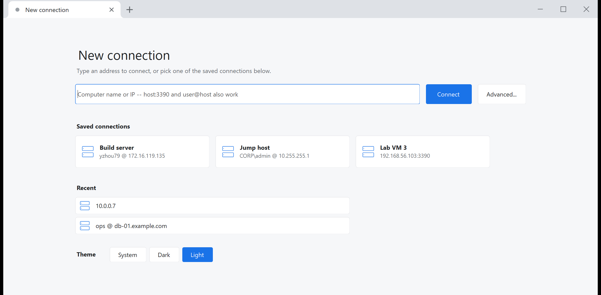

# RdpTabs — a Remote Desktop client with Chrome-style tabs

Windows' own mstsc works well; the one thing it lacks is **tabs**. Connect to a few machines at once and you
end up with a pile of windows to hunt through on the taskbar.

RdpTabs reuses the Remote Desktop engine that ships with Windows (the ActiveX control inside `mstscax.dll`,
the same one mstsc drives) and only replaces the shell: a Chrome-style tab strip on top, `+` for a new
connection, one window for every session.


Two connections in one window: the first tab is the active session, the second one is a machine that could not
be reached. Every tab carries a status dot — grey = idle, amber spinner = connecting, green = connected,
red = failed or disconnected:


Clicking `+` opens a new connection page with quick connect, your saved connections and the recent ones. The
theme (system / dark / light) is switched at the bottom of that page and applied without a restart:




## Quick start

No .NET SDK required: the script finds the Roslyn compiler that ships with Visual Studio and produces a
single-file .NET Framework 4.8 executable.

```bash
build.cmd
```

Output: `bin\RdpTabs.exe` (about 450 KB with the embedded icon, no external dependencies).

```bash
build.cmd run
```

builds and launches it. `build.cmd test` builds and runs the self test.

## Using it

| Action | Result |
|---|---|
| Click `+` | New tab showing the "New connection" page |
| Quick-connect box | `10.0.0.5`, `10.0.0.5:3390`, `user@10.0.0.5`, `CORP\user@host:3390`, `[::1]:3389` |
| "Advanced..." | Full connection settings (display, redirection, experience, gateway…) |
| Click a tab | Switch session |
| Middle-click a tab / click × | Close the tab (closing the last one closes the window) |
| Drag a tab | Reorder |
| Right-click a tab | Disconnect / Reconnect / Open another in a new tab / Edit connection / Save as connection / Close other tabs |
| Drag empty strip area | Move the window (snap, shake and double-click-to-maximize are the native ones) |
| Saved connection card | Click to connect, right-click to edit or delete |
| "Theme" row on the new tab page | System / Dark / Light, applied immediately and remembered |

Command line:

```bash
RdpTabs.exe 10.0.0.5:3390                 # connect on startup -- good for a desktop shortcut
RdpTabs.exe user@10.0.0.5
RdpTabs.exe 10.0.0.5 10.0.0.6 db@10.0.0.7 # three tabs at once
RdpTabs.exe --selftest                    # self test (see below)
RdpTabs.exe --selftest 10.0.0.5           # self test plus a real connection, logging state changes
```

When a command-line address matches a **saved connection** (host and port, plus user name if one was given),
that connection is reused with all of its settings and its stored password instead of a blank profile.

### About credentials

With no password in the profile, the RDP control pops Windows' own "Windows Security" credential prompt.
That dialog is **modal**: while it is up the whole main window is unresponsive (even the close button), so
RdpTabs brings it to the front automatically and says so on the session overlay.

⚠️ If you cancel or close that prompt, **the control stays in "connecting" forever and never reports an
error** (verified behaviour). RdpTabs adds its own 30-second hard timeout for this (paused while the prompt is
up) so you get an actionable message instead of an endless spinner. To avoid the prompt entirely, fill in user
name / domain / password under "Edit connection" and tick save.

### Keyboard shortcuts

`Ctrl+T` new tab, `Ctrl+W` close tab, `Ctrl+Tab` / `Ctrl+Shift+Tab` cycle, `Ctrl+1`…`Ctrl+9` jump to tab N.

⚠️ These only work while focus is **not** inside a remote session (for example on the new connection page).
Once you click into the remote picture, the keyboard belongs entirely to that session -- taking it back
requires a low-level keyboard hook, which this version deliberately does not install (see "Known limits").
Use the mouse to switch tabs.

## Connection settings

"Advanced..." (or right-click a tab → Edit connection) opens the full editor:


- **View**
  - *Fit window - remote resolution follows the window* (default): after a resize, a 450 ms debounce calls
    `UpdateSessionDisplaySettings`, so the remote resolution really changes instead of the picture being
    stretched. If the server does not support it, scaling takes over.
    **Minimizing does not follow** (a minimized window degenerates to 0×0 and following that would shrink the
    remote desktop to a patch), and neither does restoring from minimized. Maximizing and restoring from
    maximized **do** follow, otherwise the picture would not fill the window -- see implementation note 10:
    this control's SmartSizing only scales down, never up.
  - *Fit window - scale the remote picture*: the remote resolution stays put and the picture is scaled down to
    fit (SmartSizing). A window **larger** than the remote resolution is not scaled up; the picture is centred
    with a border (a control limitation).
  - *Fixed resolution*: the remote keeps a fixed resolution and the view scrolls when the window is smaller.
- **Scale**: follows the local DPI by default (mapped to the remote `DesktopScaleFactor` / `DeviceScaleFactor`),
  or pick 100%–200% manually. The scale is **pushed as soon as the session connects**, so you do not have to
  resize the window to trigger it (see implementation note 9).
- **Disable remote animations** (on by default): sets the `PerformanceFlags` bits for *menu fades 0x4*,
  *full-window drag 0x2* and *cursor shadow 0x20* in every experience tier. They do not help responsiveness
  but every frame has to travel over the wire, which is a common source of stutter.
  ⚠️ RDP can only control those few. Windows' own **minimize/maximize animations, taskbar animations and
  Explorer transitions** are not controlled by RDP; turn them off **on the remote machine**
  (Settings → Accessibility → Visual effects → Animation effects, or `sysdm.cpl` → Advanced → Performance →
  Adjust for best performance).
- **Experience tier**: automatic/LAN, balanced, low bandwidth (the latter two also drop the wallpaper, theming
  and cursor settings). The automatic tier uses `NetworkConnectionType` 7 (auto detect) rather than 6 (LAN) so
  the server measures the actual link instead of assuming a LAN.
  Note that `PerformanceFlags` is only sent during the connection handshake, so changes need a **reconnect**.
- **Redirection**: clipboard (on by default), printers, local drives, serial/parallel ports, smart cards,
  remote audio, microphone.
- **Windows keys**: whether Win / Alt+Tab stay local (default is "only in full screen", same as mstsc).
- **Server authentication**: the same three `AuthenticationLevel` choices mstsc offers; the default tries and
  only warns on failure.
- **RD Gateway**: enter the gateway address. With a gateway, the TCP pre-flight below is skipped, since the
  target is not directly reachable by design.

## Settings and passwords

Settings file: `%APPDATA%\RdpTabs\profiles.json` (saved connections, recent connections, window placement,
theme choice).

With "Save password" ticked, the password is encrypted with **DPAPI (the current Windows account's key)**
before being written, so the file holds Base64 ciphertext and never the plaintext. Another user or another
machine cannot decrypt it -- there it silently becomes an empty password and you just type it again. If you
would rather not store a password at all, leave the box unticked and let the control prompt.

## Implementation notes

There is a single source tree under `src\`, shared by both build paths:

| Path | Command | Status |
|---|---|---|
| .NET Framework 4.8 (zero install) | `build.cmd` | **verified on this machine** |
| .NET 8 (needs the .NET SDK) | `dotnet build -c Release` | `RdpTabs.csproj` is provided but untested here (no SDK installed) |

To let both paths share one source tree with no NuGet packages or interop assemblies:

- **COM goes through IDispatch late binding** (the reflection wrapper in `src/Com.cs`), so no MSTSCLib
  generated by tlbimp/aximp is needed.
- **DPAPI is a direct P/Invoke to `crypt32`**, avoiding the `System.Security.Cryptography.ProtectedData`
  package.
- **JSON is hand-written** (`src/MiniJson.cs`) instead of `System.Text.Json`.

Things worth remembering:

1. **The ActiveX CLSID has to be probed for one that can actually be created.**
   On Windows 11 both the ProgID and the CLSID of `MsTscAx.MsTscAx.13` are in the registry, but
   `mstscax.dll`'s class factory does not implement it and `CoCreateInstance` returns
   `CLASS_E_CLASSNOTAVAILABLE`. So `RdpAxHost` walks from `.13` downwards and **actually creates** each
   candidate, keeping the first that works (`.12` on this machine).
2. **Connection state is polled, not evented.** Late binding cannot reach `IMsTscAxEvents` (sinking the event
   source dispinterface needs IConnectionPoint plus exact DISPIDs), so the `Connected` property is polled
   every 250 ms. **Its values are `0 = disconnected`, `1 = connected`, `2 = connecting`** -- 1 and 2 are easy
   to swap, and swapping them means the session is already up while the UI still says "connecting" with the
   overlay covering the remote picture. This was pinned down empirically using
   `UpdateSessionDisplaySettings`, which only succeeds on a live session, and is now encoded as named
   constants in `src/RdpSessionControl.cs`.
3. **A TCP pre-flight runs before connecting** (3 s timeout). Since `OnDisconnected` is unreachable, the most
   common failures (unresolvable name, closed port, unreachable host) are diagnosed by us and get an accurate
   message; everything else falls back to the control's `ExtendedDisconnectReason` mapped to text, with
   unknown codes printed as-is rather than invented. The control's `overallConnectionTimeout` (confirmed to be
   applied) does not fire while a credential prompt is up or after one is cancelled, hence our own 30 s
   timeout.
4. **The frameless window keeps native behaviour**: `FormBorderStyle.Sizable` plus a `WM_NCCALCSIZE` that
   removes only the top caption (and, when maximized, still insets the top by the frame thickness, or content
   lands off-screen), combined with the tab strip returning `HTTRANSPARENT` for blank areas so hit-testing
   falls through to the parent, which answers `HTCAPTION`. Snapping, shaking, double-click-to-maximize, edge
   resizing, Win11 rounded corners and the drop shadow are therefore all the system's.
5. **DPI**: the process declares system DPI awareness (so the remote picture stays pixel-crisp), every size
   goes through `Dpi.Scale()`, and all forms use `AutoScaleMode.None` so WinForms' font auto-scaling does not
   stack on top of the hand-written layout.
6. **Every layout measures its text** with `TextRenderer.MeasureText` instead of hard-coding widths and
   heights: line heights and glyph widths vary by font family, DPI and script (a profile name in a script the
   UI font lacks is rendered through GDI font-linking and comes out much wider than expected).
7. **Theme**: two complete palettes with three modes (system / dark / light), switchable at the bottom of the
   new tab page, repainted live without a restart and remembered in the settings file. The "system" mode
   reacts to `WM_SETTINGCHANGE`.
   Scrollbars and message boxes are system-drawn, so they follow the theme through uxtheme:
   `SetPreferredAppMode` (undocumented ordinal 135) plus `SetWindowTheme(hwnd, "DarkMode_Explorer")` on every
   scrolling panel. Both calls are guarded -- if they fail, the scrollbars simply stay light.
8. **The icon is Windows' own Remote Desktop icon**: `RdpTabs.ico` is a byte-for-byte copy of `mstsc.exe`'s
   `RT_GROUP_ICON`/`RT_ICON` resources (9 sizes including the 256 px PNG). Do **not** try to produce it with
   `PrivateExtractIcons` plus `Icon.ToBitmap()` -- the large sizes come out as noise. The build embeds it both
   as the exe's win32 icon (Explorer / taskbar) and as a managed resource for run-time size selection.
9. **DPI scaling can only be applied after connecting.** No late-bindable property sets the scale before the
   connection: `DesktopScaleFactor` / `DeviceScaleFactor` always return `DISP_E_UNKNOWNNAME` through
   IDispatch, and they live only on `IMsRdpExtendedSettings`, which is a pure vtable interface --
   QueryInterface succeeds, but calling members in the order guessed from the IDL **segfaults the process**,
   so do not go there. What works: the moment the state becomes connected, push size and scale factors with
   `UpdateSessionDisplaySettings` (retried up to 4 times via the debounce timer, then falling back to
   SmartSizing).
10. **SmartSizing only scales down, never up** (verified: with `SmartSizing=1`, a 1800×1200 remote and a
    2534×1799 control area, the picture stayed at its original size, centred, with an `#ABABAB` border; the
    result was identical with the connect-time display-control call removed entirely). So the only way to fill
    a window larger than the remote resolution is to change that resolution, which is why maximizing has to
    follow the window.

## Self test

```bash
bin\RdpTabs.exe --selftest
```

Runs 22 checks without needing any RDP server and writes the log to `%TEMP%\RdpTabs-selftest.log`:

- mstscax.dll version, ActiveX ProgID/CLSID lookup and instantiation
- late-bound property access, the `AdvancedSettings` version fallback, `ClearTextPassword` being writable
  (which proves we got the NotSafeForScripting class), `GrabFocusOnConnect`, `SmartSizing`,
  `KeyboardHookMode`, the connect timeouts reading back, whether `UpdateSessionDisplaySettings` exists
- the "disable remote animations" switch turning into the right `PerformanceFlags` bits
- DPAPI encrypt/decrypt round-trip, JSON round-trip
- all three pre-flight outcomes (unknown host / closed port / reachable)
- app icon loading, rendered to `%TEMP%\RdpTabs-icon.png`
- tab strip geometry: the hit result at each tab centre, close button, `+`, the window buttons and the blank
  area, rendered to `%TEMP%\RdpTabs-tabstrip.png`
- connection dialog: every control's size plus a clipped-text check, rendered to `%TEMP%\RdpTabs-dialog.png`

Give it an address and it also makes a real connection: it logs every state change and the raw `Connected`
value, then scripts minimize / restore / maximize / restore / manual resize and reports whether each one
changed the remote resolution.

```bash
bin\RdpTabs.exe --selftest 10.0.0.5:3389
```

To skip the credential prompt, put the password in the environment rather than on the command line (where it
would show up in process lists):

```bash
set RDPTABS_TEST_PASSWORD=your-password
bin\RdpTabs.exe --selftest user@10.0.0.5
```

## Known limits

- **Local shortcuts do nothing while focus is inside the remote session** (see above). Fixing that needs a
  `WH_KEYBOARD_LL` hook.
- **No "send Ctrl+Alt+Del"**: it lives on `IMsRdpClientNonScriptable`, a pure vtable interface that late
  binding cannot reach. Supporting it means declaring `[ComImport]` interfaces with the exact member order.
- **Limited disconnect detail**: only the extended reason code is available, not the primary `discReason`.
- **No full-screen mode, no tearing tabs out into their own window, no .rdp import** (deliberately out of
  scope for this version).
- **Mixed-DPI multi-monitor**: the process is system-DPI aware, so moving to a monitor with a different DPI
  gets OS bitmap scaling (slightly soft).
- Background tabs stay connected and keep repainting, which makes switching instant at the cost of bandwidth.

## Possible next steps

Tearing tabs into separate windows, full screen across multiple monitors, a low-level keyboard hook plus
"send Ctrl+Alt+Del", .rdp import/export, and real event callbacks (which would need the .NET SDK path with
`COMReference`-generated strongly typed interop, giving access to `OnDisconnected`'s full reason).
